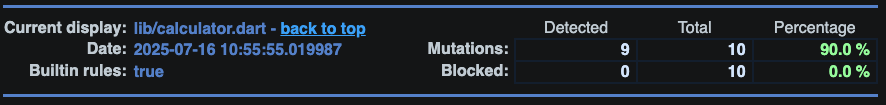

<h1 align="center">
  <br>
  <a href="https://pragmacolombia.com/"></a>
  <br>
  Mutation Testing Demo
  <br>
</h1>

<h4 align="center">Proyecto educativo de <a href="https://pragmacolombia.com/" target="_blank">Pragma</a>.</h4>

<p align="center"> 
  
   
</p>

Este proyecto es un ejemplo educativo que demuestra cómo implementar y aplicar mutation testing en aplicaciones Flutter. Está diseñado para ayudar a desarrolladores a entender los conceptos fundamentales del mutation testing, cómo evaluar la calidad de sus pruebas unitarias y mejorar la robustez del código a través de mutaciones estratégicas.

<p align="center">
  <a href="#topicos">Tópicos</a> •
  <a href="#tecnologias">Tecnologías</a> •
  <a href="#consideraciones">Consideraciones</a> •
  <a href="#descarga">Descarga</a> •
  <a href="#instalación-y-ejecución">Instalación y ejecución</a> •
  <a href="#autores">Autores</a> •
  <a href="#relacionados">Relacionados</a> •
  <a href="#roadmap">Roadmap</a>
</p>

## Tópicos
- <a href="#introducción-al-mutation-testing">Introducción al Mutation Testing</a>
- <a href="#qué-son-los-mutantes">Qué son los Mutantes</a>
- <a href="#estructura-del-proyecto">Estructura del Proyecto</a>
- <a href="#organización-de-carpetas">Organización de Carpetas</a>
- <a href="#ejemplos-de-mutantes">Ejemplos de Mutantes</a>
- <a href="#implementación-de-mutation-testing">Implementación de Mutation Testing</a>
- <a href="#conceptos-de-testing-demostrados">Conceptos de Testing Demostrados</a>
- <a href="#prácticas-demostradas">Prácticas Demostradas</a>
- <a href="#mejores-prácticas-para-mutation-testing">Mejores Prácticas</a>
- <a href="#problemas-comunes-y-soluciones">Problemas Comunes y Soluciones</a>

## Introducción al Mutation Testing
El mutation testing es una técnica avanzada de evaluación de calidad de pruebas que modifica pequeñas porciones del código fuente (creando "mutantes") para verificar si las pruebas existentes pueden detectar estos cambios. A diferencia de la cobertura de código tradicional que solo verifica si una línea se ejecuta, el mutation testing evalúa si las pruebas realmente verifican el comportamiento correcto del código. Este proyecto demuestra cómo implementar mutation testing en Flutter, mostrando mutaciones comunes y cómo las pruebas bien diseñadas pueden detectarlas.

## Qué son los Mutantes
En el contexto del mutation testing, un mutante es una versión modificada del código original que contiene un cambio pequeño pero significativo. Estos cambios simulan errores que podrían introducirse durante el desarrollo:

- **Mutantes**: Versiones modificadas del código con cambios específicos
- **Operadores de Mutación**: Reglas que definen cómo modificar el código (cambiar `+` por `-`, `>` por `>=`, etc.)
- **Mutante Sobreviviente**: Un mutante que no es detectado por las pruebas existentes
- **Mutante Eliminado**: Un mutante que las pruebas detectan exitosamente

Los mutantes ayudan a:
- **Evaluar la efectividad**: Medir qué tan bien las pruebas detectan cambios en el comportamiento
- **Identificar puntos débiles**: Descubrir áreas donde las pruebas son insuficientes
- **Mejorar la cobertura**: No solo en cantidad, sino también en calidad de las aserciones
- **Fortalecer la suite de pruebas**: Creando pruebas más robustas y significativas

## Estructura del Proyecto

El proyecto contiene los siguientes componentes principales:

1. **Calculadora**: Clase principal que contiene operaciones aritméticas básicas para demostrar mutation testing.
2. **Pruebas Unitarias**: Pruebas para verificar el funcionamiento correcto de cada operación.
3. **Operadores de Mutación**: Ejemplos de mutaciones que pueden aplicarse al código.
4. **Interfaz Demo**: Una interfaz visual para explorar los conceptos de mutation testing.
5. **Reporte de Mutación**: Resultados generados tras ejecutar las pruebas de mutación.

### Organización de Carpetas

```
example_mutation_test/
├── lib/
│   ├── calculator.dart               # Clase principal con operaciones aritméticas
│   ├── main.dart                     # Punto de entrada de la aplicación demo
│   ├── enums/                        # Enumeraciones para tipos de operaciones
│   │   └── operations.dart           # Enum de operaciones matemáticas
│   ├── models/                       # Modelos de datos
│   │   └── operation_details.dart    # Detalles de cada operación
│   ├── utils/                        # Utilidades generales
│   │   └── enums.dart                # Extensiones para enums
│   └── widgets/                      # Componentes de UI
│       ├── operations_card.dart      # Widget para seleccionar operaciones
│       └── possible_mutations.dart   # Widget para mostrar mutaciones posibles
│ 
├── test/                             # Pruebas unitarias
│   └── calculator_test.dart          # Pruebas para la clase Calculator
│
├── mutation-test-report/             # Reportes generados de mutation testing
│   └── mutation-test-report.html     # Reporte HTML con resultados
│
├── pubspec.yaml                      # Dependencias y configuración del proyecto
└── README.md                         # Documentación del proyecto
```

### Ejemplos de Mutantes

#### 1. Operadores de Mutación Comunes

```
Mutaciones en Operadores Aritméticos:
+ → -, -, *, /, %
- → +, *, /, %
* → +, -, /, %
/ → +, -, *, %
% → +, -, *, /

Mutaciones en Operadores de Comparación:
> → >=, <, <=, ==, !=
< → <=, >, >=, ==, !=
== → !=, >, >=, <, <=
!= → ==, >, >=, <, <=

Mutaciones en Operadores Lógicos:
&& → ||
|| → &&
! → (eliminar el operador)
```

**Ventajas del Mutation Testing:**
- Evalúa la calidad real de las pruebas, no solo la cobertura
- Identifica casos borde no probados
- Mejora la robustez del código y las pruebas
- Encuentra código muerto o redundante

## Conceptos de Testing Demostrados

### 1. Mutation Testing
- Introducción de cambios pequeños pero significativos en el código
- Evaluación de la capacidad de las pruebas para detectar mutantes
- Análisis de "supervivencia" de mutantes para mejorar la calidad de las pruebas

### 2. Cobertura de Código vs. Calidad de Pruebas
- Demostración de que una alta cobertura no garantiza pruebas efectivas
- Identificación de aserciones débiles o insuficientes
- Mejora de pruebas para cubrir casos borde y comportamientos específicos

### 3. Aserciones Robustas
- Verificación precisa de resultados esperados: `expect(calculator.add(2, 3), equals(5))`
- Verificación de excepciones: `expect(() => calculator.divide(5, 0), throwsArgumentError)`
- Verificación de comportamiento booleano: `expect(calculator.isEven(2), isTrue)`

### 4. Análisis de Mutantes Sobrevivientes
- Identificación de por qué ciertos mutantes sobreviven
- Mejora iterativa de pruebas para eliminar mutantes
- Documentación de casos donde los mutantes son equivalentes

## Prácticas Demostradas

1. **Organización de Pruebas de Mutation Testing**
   - Uso de `group` para agrupar pruebas de funcionalidades relacionadas
   - Nombres descriptivos que explican el propósito de cada prueba
   - Pruebas específicas para cada comportamiento de la función

2. **Análisis de Mutantes**
   - Identificación de mutantes que sobreviven
   - Documentación de por qué un mutante sobrevive
   - Propuesta de mejoras para eliminar mutantes sobrevivientes

3. **Patrón AAA (Arrange-Act-Assert)**
   - Preparación de los datos de entrada (arrange)
   - Ejecución de la función bajo prueba (act)
   - Verificación del resultado esperado (assert)

4. **Pruebas Robustas**
   - Verificación de casos borde (división por cero, etc.)
   - Pruebas de comportamiento esperado en diferentes escenarios
   - Aserciones precisas que verifican resultados específicos
   
5. **Visualización de Mutantes**
   - Interfaz visual para explorar posibles mutaciones
   - Explicación didáctica de cada tipo de mutación
   - Ejemplos concretos de cómo afecta cada mutación al código

## Mejores Prácticas para Mutation Testing

### 1. Creación de Pruebas Específicas

Escribe pruebas que verifiquen comportamientos específicos, no solo cobertura:

```dart
// Prueba débil (solo verifica que la función no lanza error)
test('debe calcular max', () {
  calculator.max(5, 3); // No hay aserciones específicas
});

// Prueba robusta
test('debe retornar el primer número cuando es mayor', () {
  expect(calculator.max(5, 3), equals(5));
});
```

### 2. Verificación de Casos Borde

Identifica y prueba casos borde para eliminar mutantes:

```dart
// Pruebas para diferentes escenarios
test('debe lanzar ArgumentError cuando se divide por cero', () {
  expect(() => calculator.divide(5, 0), throwsArgumentError);
});
```

### 3. Organización de Pruebas

Agrupa pruebas relacionadas para mayor claridad:

```dart
group('isEven', () {
  test('debe retornar true para números pares', () {
    expect(calculator.isEven(2), isTrue);
    expect(calculator.isEven(4), isTrue);
    expect(calculator.isEven(0), isTrue);
  });

  test('debe retornar false para números impares', () {
    expect(calculator.isEven(1), isFalse);
    expect(calculator.isEven(3), isFalse);
    expect(calculator.isEven(5), isFalse);
  });
});
```

### 4. Interpretación de Resultados

Aprende a analizar el informe de mutation testing:

```dart
// Ejemplo de análisis
/* 
 * MUTATION TESTING:
 * Un mutante sobrevivió en la siguiente línea:
 * if (a >= b) {  // El operador '>=' fue mutado a '>'
 * ¿Por qué sobrevivió?
 *   Porque los tests actuales consideran el caso donde ambos números son
 *   iguales, pero no verifican específicamente qué valor debe retornarse
 *   cuando son iguales.
 */
```

### 5. Mejora Iterativa

Usa mutation testing para mejorar continuamente tus pruebas:

```dart
// Prueba mejorada después de encontrar un mutante
test('debe retornar específicamente el primer argumento cuando ambos son iguales', () {
  // Técnica avanzada para verificar que se retorna exactamente el primer argumento
  // (podría requerir refactorización de la función para poder probar esto)
});
```

### 6. Equilibrio con Mutantes Equivalentes

Reconoce cuándo un mutante es equivalente y no puede ser eliminado:

```dart
// Documentación para mutantes equivalentes
/* 
 * Este mutante (cambiar 'a + 0' a 'a') es equivalente 
 * y no afecta el comportamiento del código.
 * No es necesario modificar las pruebas para este caso.
 */
```

## Implementación de Mutation Testing

El mutation testing es una técnica avanzada que evalúa la calidad de las pruebas unitarias mediante la introducción sistemática de cambios (mutaciones) en el código fuente. En este proyecto, utilizamos la biblioteca `mutation_test` para Dart/Flutter.

### Proceso de Mutation Testing

```
Código Original → Generar Mutantes → Ejecutar Pruebas → Analizar Resultados → Mejorar Pruebas
```

### Componentes Clave

#### Operadores de Mutación
Los operadores de mutación son reglas que definen cómo modificar el código para crear variantes (mutantes):

```dart
// Código original
int add(int a, int b) {
  return a + b;
}

// Mutante 1: cambiar + por -
int add(int a, int b) {
  return a - b;  // Este mutante debería ser detectado por las pruebas
}

// Mutante 2: cambiar + por *
int add(int a, int b) {
  return a * b;  // Este mutante debería ser detectado por las pruebas
}
```

#### Configuración de Mutation Testing

Para ejecutar mutation testing en un proyecto Flutter, se utiliza la biblioteca `mutation_test`:

```yaml
# En pubspec.yaml
dev_dependencies:
  mutation_test: ^1.7.0
```

Para ejecutar las pruebas de mutación:

```bash
dart run mutation_test
```

### Análisis de Resultados

Un ejemplo real de un mutante superviviente en este proyecto:

```dart
/// Devuelve el mayor de dos números.
///
/// MUTATION TESTING:
/// Un mutante sobrevivió en la siguiente línea:
/// if (a >= b) {  // El operador '>=' fue mutado a '>'
/// y los tests no detectaron el cambio.
int max(int a, int b) {
  if (a >= b) {  // Cambiar a 'a > b' crea un mutante que sobrevive
    return a;
  } else {
    return b;
  }
}
```

### Mejora Continua

El proceso de mutation testing es iterativo:

1. **Identificar Mutantes Supervivientes**: Analizar qué mutaciones no son detectadas
2. **Entender Por Qué**: Comprender qué comportamiento no está siendo verificado
3. **Mejorar Pruebas**: Añadir casos de prueba específicos para los escenarios no cubiertos
4. **Re-ejecutar**: Volver a ejecutar el mutation testing y verificar la mejora

Este ciclo ayuda a fortalecer constantemente la calidad de las pruebas y la robustez del código.

## Tecnologías
- [Flutter](https://flutter.dev/) versión 3.32+ - Framework de desarrollo de aplicaciones multiplataforma
- [mutation_test](https://pub.dev/packages/mutation_test) - Paquete para realizar pruebas de mutación en Dart/Flutter
- [flutter_test](https://api.flutter.dev/flutter/flutter_test/) - Marco de pruebas oficial de Flutter
- [test](https://pub.dev/packages/test) - Paquete de pruebas estándar de Dart
- [Material 3](https://m3.material.io/) - Sistema de diseño para la interfaz de usuario

## Consideraciones
- Asegúrate de tener Flutter SDK 3.32 o superior instalado y configurado en tu máquina.
- Las pruebas de mutación pueden tardar más tiempo en ejecutarse que las pruebas unitarias estándar.
- El reporte de mutación se genera en HTML y se puede encontrar en `mutation-test-report/`.
- Este proyecto está diseñado para ser educativo y demostrar buenas prácticas de Mutation Testing.
- Los mutantes identificados se comentan directamente en el código para propósitos didácticos.

## Descarga

Para clonar esta aplicación desde la línea de comando:

```bash
git clone https://github.com/id-am/example_mutation_test.git
cd example_mutation_test
```

## Ejecución de la Aplicación Demo

Para ejecutar la aplicación demostrativa:

```bash
flutter pub get
flutter run
```

La aplicación muestra una interfaz interactiva donde puedes explorar diferentes operaciones matemáticas y las posibles mutaciones que podrían aplicarse a ellas.

## Ejecución de Pruebas de Mutación

Para ejecutar las pruebas de mutación:

```bash
# Primero ejecutar las pruebas unitarias normales
flutter test

# Luego ejecutar las pruebas de mutación
dart run mutation_test 
```

El reporte generado mostrará:
- Total de mutantes generados
- Mutantes eliminados (killed)
- Mutantes sobrevivientes (survived)
- Puntuación de mutación (mutation score)
- Detalles de cada mutante para análisis


## Instalación y ejecución

Es necesario contar con Flutter instalado y configurado en tu máquina. Puedes seguir la guía de instalación oficial de Flutter [aquí](https://flutter.dev/docs/get-started/install).

```bash
# Descargar dependencias
flutter pub get

# Ejecutar la aplicación demo
flutter run

# Ejecutar pruebas unitarias
flutter test

# Ejecutar pruebas de mutación
dart run mutation_test
```
## Problemas Comunes y Soluciones

### 1. Mutantes Equivalentes

**Problema**: Algunos mutantes nunca pueden ser "matados" porque son funcionalmente equivalentes al código original.

**Solución**:
- Documentar estos casos para futuras referencias
- Centrarse en mejorar otros mutantes detectables
- Considerar refactorizar el código para eliminar redundancias

```dart
// Ejemplo: Estos mutantes son equivalentes
int función(int a) {
  return a + 0;  // Mutar a 'a' es equivalente
}

bool esMayor(int x) {
  return x > 0 ? true : false;  // Mutar a 'return x > 0' es equivalente
}
```

### 2. Tiempo de Ejecución Excesivo

**Problema**: Las pruebas de mutación pueden ser muy lentas en proyectos grandes.

**Solución**:
- Ejecutar mutation testing solo en módulos críticos
- Limitar el número o tipos de mutantes generados
- Paralelizar la ejecución cuando sea posible

### 3. Falsos Positivos

**Problema**: Algunos mutantes sobreviven aunque parezca que deberían ser detectados.

**Solución**:
- Revisar cuidadosamente las pruebas existentes
- Verificar si hay aserciones demasiado generales
- Añadir casos de prueba específicos para estos mutantes

```dart
// En lugar de:
test('max funciona', () {
  expect(calculator.max(5, 3), greaterThan(2));  // Aserción demasiado general
});

// Mejor:
test('max retorna el valor mayor correctamente', () {
  expect(calculator.max(5, 3), equals(5));  // Aserción específica
});
```

### 4. Errores en el Reporte

**Problema**: El reporte de mutation testing puede mostrar resultados confusos o incompletos.

**Solución**:
- Actualizar a la última versión de la herramienta de mutation testing
- Verificar la configuración del proyecto
- Ejecutar las pruebas unitarias primero para asegurarse de que todas pasan

### 5. Conflictos con Anotaciones o Macros

**Problema**: Las herramientas de mutation testing pueden confundirse con anotaciones o código generado.

**Solución**:
- Configurar la herramienta para ignorar ciertos patrones o archivos
- Separar el código generado del código escrito manualmente
- Usar comentarios especiales para marcar secciones que no deben mutarse

### 6. Como interpretar el reporte de mutación

El reporte de mutación generado contiene información detallada sobre cada mutante, incluyendo:
- **Descripción del Cambio**: Qué cambio se realizó en el código original.
- **Estado del Mutante**: Si fue eliminado (killed) o sobrevivió (survived).
- **Pruebas Afectadas**: Qué pruebas se ejecutaron y su resultado.
- **Cobertura de Mutación**: Porcentaje de mutantes eliminados respecto al total generado.
- **Bloqueado**: Se refiere a mutaciones que el sistema no pudo aplicar debido a restricciones del código, configuraciones o alguna razón externa.



Si el mutante muere te indica que la prueba es efectiva para detectar ese tipo de cambio y se resalta en color verde.


Si un mutante sobrevive, significa que las pruebas no son lo suficientemente robustas para detectar ese cambio y se resalta en color rojo.


## Autores

[<br><sub>Ivan Dario Avila Martinez</sub>](https://github.com/idamkiller)


## Relacionados
- [Documentación oficial de Flutter Testing](https://docs.flutter.dev/testing)
- [Mutation Testing (Artículo)](https://medium.com/@shubhgajjar2004/testing-of-the-test-suite-our-hero-mutationtesting-7a26f929d8f0)
- [Flutter Test Package](https://api.flutter.dev/flutter/flutter_test/flutter_test-library.html)
- [Mutation Testing Package](https://pub.dev/packages/mutation_test)
- [Flutter Testing Best Practices](https://flutter.dev/docs/testing/best-practices)

## Roadmap
- Unit Testing → Complejidad baja, pruebas de funciones individuales y lógica de negocio.
- Widget Testing → Complejidad media, pruebas de widgets y UI.
- Integration Testing → Complejidad alta, pruebas de integración entre componentes.
- Mutation Testing → Complejidad media, evaluar la calidad de las pruebas unitarias.